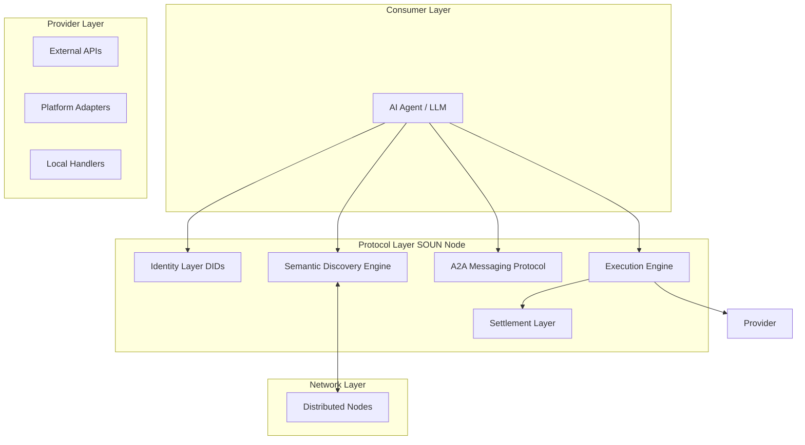

# 🌐 SOUN — Semantic Orchestration & Universal Network (v2.1)

“We’ve built a fully functional prototype of an AI execution network and are now onboarding the first external agents and providers.”

SOUN (Semantic Orchestration & Universal Network) is a full-stack execution protocol designed to transform the internet from a system of passive information into a decentralized mesh of autonomous, machine-driven actions.

It bridges the gap between AI reasoning and real-world execution, evolving from a closed-loop simulation into a globally distributed, open execution network.

⸻

## 🧠 1. The Vision — The Action Layer of the Internet

The traditional internet is built for:
- browsing
- interfaces
- human interaction

SOUN introduces a new primitive:

**Execution as the default interface of the web**

Every interaction follows a deterministic lifecycle:

> Intent → Discovery → Negotiation → Execution → Settlement → Learning

This transforms:
- APIs → Actions
- Platforms → Providers
- Users → Agents

⸻

## 🗺️ 2. Architecture & Data Flow

SOUN operates as a distributed execution mesh, where each node functions as:
- a registry
- an execution engine
- a communication relay
- a settlement layer

⸻

## 🧬 3. Core Architectural Pillars

### 🆔 Identity Layer (Decentralized Identity System)

The identity system ensures that every participant in the network is uniquely identifiable and accountable.
- Each agent is assigned a Decentralized Identifier (DID)
- Trust scores evolve based on execution history
- Identity becomes the foundation for:
  - trust
  - permissions
  - economic participation

### 🔍 Discovery Layer (Semantic Execution Graph)

The discovery system maps intent to executable capabilities.
- Semantic parsing aligns human language to structured actions
- Distributed querying enables multi-node discovery
- Ranking is based on:
  - relevance
  - trust
  - performance

### ⚙️ Execution Layer (Resilient Orchestration Engine)

The execution engine is the core runtime of SOUN.
- Validates inputs using schema enforcement
- Routes execution dynamically:
  - internal
  - external
  - peer nodes
- Implements:
  - retry logic
  - fallback providers
  - execution guarantees

### 💬 Communication Layer (Agent-to-Agent Protocol)

Defines how agents collaborate.
- negotiation of tasks
- delegation of sub-actions
- state synchronization

### ⛓️ Economy Layer (Programmable Settlement)

Ensures trustless value exchange.
- execution triggers payment
- ledger maintains immutable history
- supports multi-asset transactions

⸻

## 🛠 4. Technical Reference

### Core File Structure
- `src/core/registry.ts`: The central discovery and peer management hub.
- `src/core/execution-engine.ts`: The resilient pipeline for validating and running actions.
- `src/core/blockchain.ts`: The PoW ledger implementation.
- `src/core/agent-registry.ts`: DID management and agent reputation tracking.
- `src/core/payment-system.ts`: The economic bridge between agents and the blockchain.
- `src/core/messaging.ts`: The A2A communication layer.
- `src/adapters/`: Native bridges for platforms like **Shopify** and **WooCommerce**.

### Key API Endpoints
| Endpoint | Method | Description |
| :--- | :--- | :--- |
| `/.soun` | GET | System manifest and discovery. |
| `/api/handshake` | POST | Autonomous agent onboarding. |
| `/api/search` | POST | Semantic discovery of actions across the mesh. |
| `/api/execute/:id` | POST | Resilient execution with blockchain settlement. |
| `/api/tools` | GET | Native OpenAI/Claude function definitions. |
| `/api/messages` | GET/POST | A2A messaging and subcontracting. |
| `/api/blockchain` | GET | Audit the immutable ledger. |

⸻

## 🚀 5. Phase 3 — Reality (Current Stage)

SOUN has transitioned from:

simulated execution → real-world interaction

The system now supports:
- external API execution
- agent-driven workflows
- verifiable transaction logging

⸻

## 🔮 6. FUTURE ROADMAP — THE EVOLUTION OF SOUN

This is where we go from prototype → protocol → global infrastructure

⸻

### 🧱 PHASE 3 (NOW → NEXT 3 MONTHS)
**Activation & Real-World Validation**

**Objective:**
Transform Soun from a closed prototype into a live execution network

**Key Focus Areas:**

🔌 **1. External Ecosystem Onboarding**
- onboard first 10–50 external providers
- enable plug-and-play action registration
- create standardized provider SDKs

🤖 **2. Agent Adoption**
- integrate with:
  - LLM tool calling
  - custom agent frameworks
- enable real agents to use Soun autonomously

📊 **3. Execution Metrics Layer**
- capture:
  - execution success rates
  - latency
  - cost efficiency
- feed data back into ranking

🧪 **4. Real Use Case Validation**
- e-commerce automation
- API orchestration
- webhook-based workflows

**Outcome:**
First real executions outside the system

⸻

### 🌐 PHASE 4 (3–9 MONTHS)
**Network Formation**

**Objective:**
Turn Soun into a multi-node distributed system

**Key Focus Areas:**

🌍 **1. Real P2P Infrastructure**
- replace simulated nodes with real nodes
- implement:
  - peer discovery
  - distributed search

🔗 **2. Cross-Node Execution**
- allow:
  - node A → node B execution
- enable geographic distribution

🧠 **3. Distributed Trust Graph**
- global reputation system
- trust propagation across nodes

🔌 **4. Open Developer Platform**
- SDKs (JS, Python)
- public API access
- documentation + onboarding tools

**Outcome:**
Soun becomes a network, not a product

⸻

### 💳 PHASE 5 (9–18 MONTHS)
**Economic Layer Maturation**

**Objective:**
Introduce real, scalable economic infrastructure

**Key Focus Areas:**

💰 **1. Real Payment Integration**
- integrate:
  - fiat rails
  - stablecoins
- enable real transactions

🧾 **2. Pricing Models**
- dynamic pricing for actions
- bidding / marketplace mechanisms

🛡️ **3. Trustless Settlement**
- escrow systems
- dispute resolution

📊 **4. Economic Analytics**
- track:
  - volume
  - revenue
  - provider performance

**Outcome:**
Soun becomes an economic network

⸻

### 🧬 PHASE 6 (18–36 MONTHS)
**Autonomous Agent Economy**

**Objective:**
Enable agents to operate independently within Soun

**Key Focus Areas:**

🤖 **1. Fully Autonomous Agents**
- agents:
  - discover
  - decide
  - execute
  - optimize

🔄 **2. Multi-Step Orchestration**
- workflows composed of multiple actions
- dynamic chaining

🧠 **3. Learning Systems**
- reinforcement learning from execution outcomes
- adaptive decision-making

🌐 **4. Cross-Domain Execution**
- travel
- commerce
- finance
- enterprise ops

**Outcome:**
Agents become economic actors

⸻

### 🏛️ PHASE 7 (LONG TERM)
**Decentralized Governance & Protocol Standardization**

**Objective:**
Transition Soun into a global standard

**Key Focus Areas:**

🏛️ **1. Protocol Governance**
- DAO-based upgrades
- community-driven standards

🔐 **2. Privacy & Security**
- zero-knowledge proofs
- secure execution

🌉 **3. Cross-Network Interoperability**
- integration with other protocols
- cross-chain execution

📜 **4. Standardization**
- Soun becomes:
  - HTTP-equivalent for actions

**Outcome:**
Soun becomes the default execution layer of the AI Internet

⸻

## 🧬 FINAL STATEMENT

Soun is not just a system—it is the transition of the internet from information to execution.

⸻

## 🚀 CLOSING LINE

“From one node executing actions… to a world where billions of agents transact autonomously.”

---

## 📄 License

This project is licensed under the **PolyForm Noncommercial License 1.0.0**. 

It is open source for non-commercial use, personal study, research, and use by non-profit organizations. Commercial use requires a separate license. See the [LICENSE](LICENSE) file for the full text.
