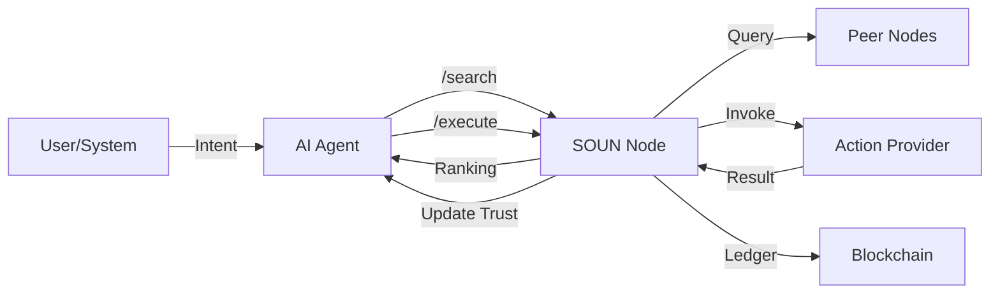

# 🌐 PROJECT SOUN — The Universal Execution Protocol (v1.9)

Project Soun is a next-generation protocol designed to transform the internet from a system of **passive information retrieval** into a system of **active, machine-driven execution**. It provides the foundational fabric for AI agents to discover, evaluate, and execute real-world tasks across a decentralized network.

---

## 🧠 1. What is Project Soun?

Traditional internet systems are built for humans: they rely on graphical interfaces (UI), clicking, and manual navigation. **Project Soun** redefines this by introducing a **machine-native interface** where every interaction is modeled as a transformation:

> **Intent → Action → Execution → Outcome → Learning**

It is the "HTTP for Actions"—a standardized way for an AI (like ChatGPT, Claude, or an autonomous enterprise agent) to actually *do* things like booking flights, ordering supplies, or managing e-commerce stores across an open network.

---

## 🗺️ 2. Architecture & Data Flow



---

## 🧬 3. How It Works (The Core Layers)

Project Soun is built on four architectural pillars that ensure security, discovery, reliability, and economic sustainability.

### 🆔 Layer 1: Identity (DIDs)
Every participant in the network—whether an AI Agent or a Service Provider—has a unique **Decentralized Identifier (DID)** (e.g., `did:soun:77e00022-035`).
- **Verifiable Reputation**: Every execution is attributed to a DID, allowing the network to track success rates and build "Trust Scores."
- **Passport for AI**: Agents carry their identity across different nodes in the global mesh.

### 🔍 Layer 2: Discovery (Distributed Search)
The network operates as a P2P mesh. When an agent needs to perform a task:
- **Intent Normalization**: The node converts natural language (e.g., "get me a ride") into a canonical action (`book_cab`).
- **Parallel Querying**: The node searches its local registry and simultaneously asks all connected **Peer Nodes** if they have a matching provider.
- **AI Tool Export**: All discovered actions are automatically served as **OpenAI/Claude Function Definitions**, making them instantly callable by LLMs.

### ⚙️ Layer 3: Execution (The Engine)
The **Execution Engine** is the heart of the node. It handles the "heavy lifting" of making things happen:
- **Schema Guard**: Every action has a **JSON Schema**. The engine validates agent input *before* execution to prevent errors.
- **Smart Routing**: It routes requests to internal code, external APIs, or proxies them to Peer Nodes.
- **Self-Healing**: If a provider fails, the engine automatically **retries** with exponential backoff. If it still fails, it searches for a **Fallback** provider to ensure the agent's goal is met.

### ⛓️ Layer 4: Economy (Blockchain Ledger)
To prevent spam and incentivize providers, Soun has a built-in blockchain economy:
- **Immutable Ledger**: Every execution payment is recorded in a Proof-of-Work block.
- **Native Wallets**: Agents pay **SOUN credits** to providers for every successful execution.
- **Trustless Settlement**: Balances are derived from the blockchain, making the economy tamper-proof and auditable.

---

## 🔄 3. The Lifecycle of an Action

1.  **Registration**: A website (e.g., a Pizza Shop) hosts a `soun.json` file. A SOUN node crawls it and registers its "Order Pizza" action.
2.  **Discovery**: An AI Agent asks, "I'm hungry, order me a pepperoni pizza." The node finds the registered action and returns the technical schema.
3.  **Validation**: The Agent sends the order data. The node checks if `topping: "pepperoni"` matches the required schema.
4.  **Payment**: The node verifies the Agent has enough SOUN credits in its blockchain wallet.
5.  **Execution**: The node calls the Pizza Shop's API. If it times out, the node retries or finds another shop.
6.  **Finalization**: The transaction is recorded in a new block on the chain, and the Pizza Shop gets paid.

---

## 📊 4. Observability & Tools

Project Soun provides deep visibility into the autonomous internet:
- **Real-time Dashboard**: Monitor system metrics, active peers, and live agent identities at `http://localhost:3001`.
- **Blockchain Explorer**: Audit every transaction and block hash directly from the web interface.
- **Interactive API Docs**: Explore the protocol via Swagger at `http://localhost:3001/docs`.
- **Website Crawler**: Onboard new websites into the network with a single click.

---

## 🏗 5. Developer Guide

### Setup
```bash
# Install dependencies
npm install

# Start the node (Registry, Engine, Blockchain, and Dashboard)
npm start
```

### Verification
Run the built-in simulation to see the full Identity → Discovery → Execution → Blockchain flow:
```bash
npx ts-node src/verify.ts
```

### Protocol Components
- [registry.ts](file:///Users/abhishek/Desktop/SOUN/SOUN/src/core/registry.ts): Discovery and Peer management.
- [execution-engine.ts](file:///Users/abhishek/Desktop/SOUN/SOUN/src/core/execution-engine.ts): Validation, Routing, and Retries.
- [blockchain.ts](file:///Users/abhishek/Desktop/SOUN/SOUN/src/core/blockchain.ts): The immutable ledger.
- [agent-registry.ts](file:///Users/abhishek/Desktop/SOUN/SOUN/src/core/agent-registry.ts): Verifiable AI identities.

---

## 🗺️ 6. Roadmap

- **v0.1 — Core API**: Basic Registry and Execution Engine. (Done)
- **v0.2 — Extensible Protocol**: `POST /register-action`, External API support, and Trust scores. (Done)
- **v1.0 — AI Internet**: OpenAI/Claude Tool export, JSON Schema validation. (Done)
- **v1.5 — Open Network**: P2P node discovery, distributed search, and proxying. (Done)
- **v1.9 — Economic Ledger**: Blockchain-backed payments and AI Identity (DIDs). (Current)
- **v2.0 — Autonomous Mesh**: Cross-chain settlement and decentralized governance. (Planned)

---

🚀 **PROJECT SOUN** — Building the foundational fabric for the autonomous AI internet.
