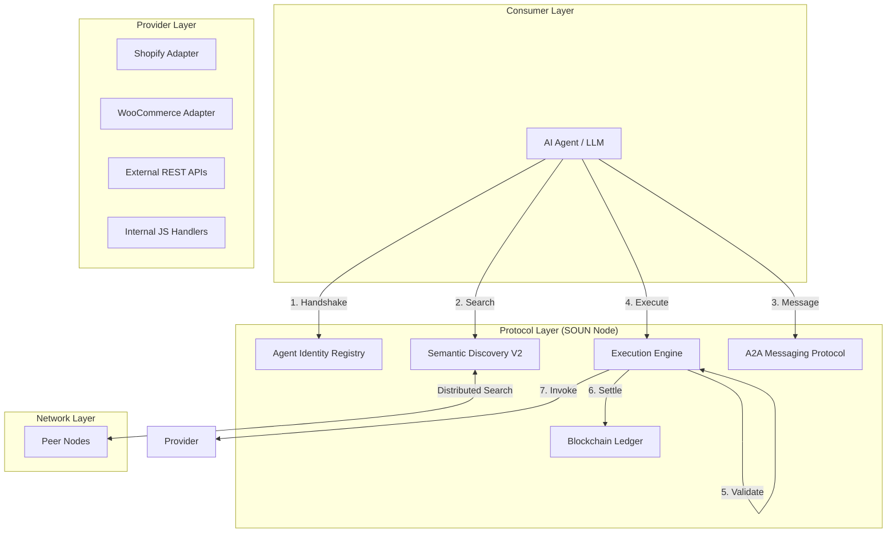

# 🌐 PROJECT SOUN — The Autonomous Mesh (v2.0)

Project Soun is a universal execution protocol designed to transform the internet from a system of **passive information retrieval** into a decentralized web of **active, machine-driven execution**. It provides the foundational fabric for AI agents to discover, communicate, and execute real-world tasks across an immutable, blockchain-backed network.

---

## 🧠 1. The Vision: The Internet for AI

Traditional internet systems are built for humans (UIs, clicking, browsing). **Project Soun** is built for Agents. It is the "Action Layer" of the web—a standardized protocol where every interaction follows a verifiable lifecycle:

> **Intent → Discovery → Negotiation → Execution → Settlement → Learning**

By standardizing how actions are registered, searched, and paid for, SOUN allows any software system to become an "Action Provider" and any AI to become an "Action Consumer."

---

## 🗺️ 2. Architecture & Data Flow

Project Soun follows a layered P2P architecture where every node acts as a registry, execution engine, and ledger keeper.



---

## 🧬 3. Core Architectural Pillars

### 🆔 Layer 1: Identity (DIDs)
- **Verifiable Identity**: Uses **Decentralized Identifiers** (`did:soun:uuid`) to ensure tamper-proof agent attribution.
- **Self-Onboarding**: The `/api/handshake` endpoint allows agents to join the network autonomously, receiving a DID and initial credits.
- **Reputation (Trust Scores)**: Every DID maintains a trust score (0.0 to 1.0) derived from historical success rates and network feedback.

### 🔍 Layer 2: Discovery (Semantic Mesh)
- **Distributed P2P Search**: Nodes query their local registry and broadcast to peer nodes in parallel.
- **Semantic V2 Scoring**: Uses a synonym-aware relevance algorithm to match conversational intent (e.g., "get me a car") to technical actions (e.g., `book_cab`).
- **Native Tooling**: Exports all registered actions as **OpenAI Function Tools** or **Claude Tools** via `/api/tools`.

### ⚙️ Layer 3: Execution (Resilient Engine)
- **Schema Guard**: Every action is defined by a **JSON Schema**. The engine enforces strict validation using `Ajv` before any code is run.
- **Smart Routing**: Routes tasks to internal handlers, external URLs, or proxies them to peer nodes across the globe.
- **Self-Healing**: Built-in **Retry Logic** (exponential backoff) and **Fallback Strategies** (automatically finding a secondary provider if the first fails).

### 💬 Layer 4: Communication (A2A Messaging)
- **Agent-to-Agent (A2A)**: A formal protocol for agents to negotiate terms, subcontract sub-tasks, and share state.
- **Persistence**: Every message is stored in a verifiable network inbox linked to the agent's DID.

### ⛓️ Layer 5: Economy (Blockchain Ledger)
- **Immutable Settlement**: Uses a Proof-of-Work blockchain to record every execution payment.
- **Multi-Currency**: Supports the native **SOUN** gas token and external assets like **USDC**.
- **Trustless Balances**: Participant balances are calculated by replaying the ledger history, making them immune to simple database tampering.

---

## 🛠 4. Technical Reference

### Core File Structure
- `src/core/registry.ts`: The central discovery and peer management hub.
- `src/core/execution-engine.ts`: The resilient pipeline for validating and running actions.
- `src/core/blockchain.ts`: The PoW ledger implementation.
- `src/core/agent-registry.ts`: DID management and agent reputation tracking.
- `src/core/payment-system.ts`: The economic bridge between agents and the blockchain.
- `src/core/messaging.ts`: The A2A communication layer.
- `src/adapters/`: Native bridges for platforms like **Shopify** and **WooCommerce**.

### Key API Endpoints
| Endpoint | Method | Description |
| :--- | :--- | :--- |
| `/.soun` | GET | System manifest and discovery. |
| `/api/handshake` | POST | Autonomous agent onboarding. |
| `/api/search` | POST | Semantic discovery of actions across the mesh. |
| `/api/execute/:id` | POST | Resilient execution with blockchain settlement. |
| `/api/tools` | GET | Native OpenAI/Claude function definitions. |
| `/api/messages` | GET/POST | A2A messaging and subcontracting. |
| `/api/blockchain` | GET | Audit the immutable ledger. |

---

## 🏗 5. Developer Guide

### Setup
```bash
# 1. Install dependencies
npm install

# 2. Start the SOUN Node
npm start
```

### Verification & Simulation
Project Soun includes a comprehensive "Agent Mesh" simulation that demonstrates the entire protocol lifecycle:
```bash
npx ts-node src/autonomous-agent.ts
```
**The simulation performs:**
1.  Autonomous Agent Onboarding (Handshake)
2.  Dynamic Action Registration
3.  Semantic Intent Search
4.  Blockchain-backed Execution
5.  A2A Subcontracting (Messaging)

### Testing
```bash
npm test
```

---

## 🗺️ 6. Roadmap

- **v0.1 — Core API**: Basic Registry and Execution Engine. (Done)
- **v1.0 — AI Internet**: Tool export, JSON Schema, and Website Crawler. (Done)
- **v1.5 — Open Network**: P2P node discovery and proxied execution. (Done)
- **v1.9 — Economic Ledger**: Blockchain-backed payments and DIDs. (Done)
- **v2.0 — Autonomous Mesh**: A2A Messaging, Semantic Discovery V2, and Self-Onboarding. (Current)
- **v3.0 — Decentralized Governance**: DAO-based protocol updates, cross-chain bridges, and zero-knowledge privacy proofs. (Planned)

---

🚀 **PROJECT SOUN** — Building the foundational fabric for the autonomous AI internet.
